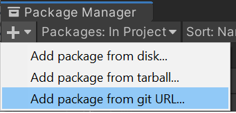

<p align="center">
  <a href="https://playerloop.io" target="_blank" align="center">
    
  </a>
  <br />
</p>

# PlayerLoop SDK for Unity

Get bug reports from your players, fast. Improve your game, reward the community.

If your player thinks there is a bug, you have something to fix. A lot of these do not throw exceptions in your code. With PlayerLoop, you can easily implement a bug reporting feature inside your game. You also get an easy-to-use interface to check the reports and download the savegame files and the screenshots to figure out what the problem is.

We are currently in free closed Beta! You can join us here on Discord: [](https://discord.gg/rGeGVqnVps)

## Getting started

If you did not do that already, head over [playerloop.io](https://playerloop.io) and sign up for an account.

Then, in your Unity project, open the package manager, click the + icon, and click on add git url.



Paste this URL:

```
https://github.com/playerloop/unity-sdk.git
```

(Set up authentication part missing)

Then, in your code, add on top:

```C#
using PlayerLoop
```

Now you can use this method to send a report:

```C#
PlayerLoopSDK.SendReport("Description of the bug as sent by the user!");
```

You can also optionally add the path to one or more files to attach them to the report. This is useful to attach savegames for example:

```C#
PlayerLoopSDK.SendReport("message from the user", new List<string>(){ "path-to-your-file" } );
```

You will usually call this method inside a dedicated UI screen that pops up after the user clicks on 'Report a bug' or something like that. You can check out the example below.

## Example scene

The package will soon include a demo scene.

## Contributing

Make a PR :)