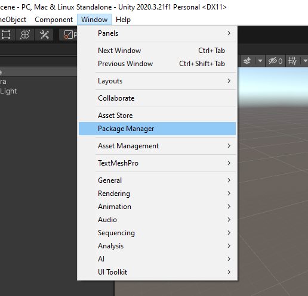
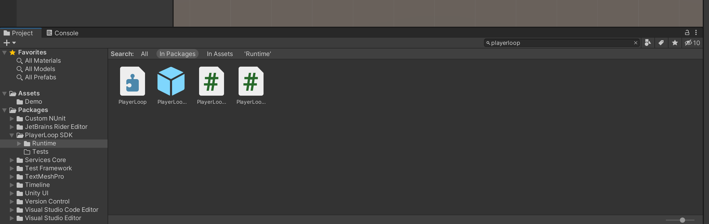
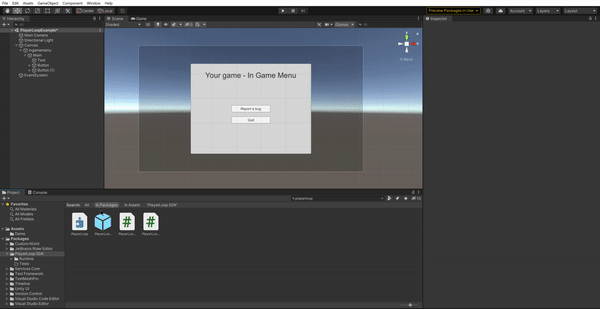
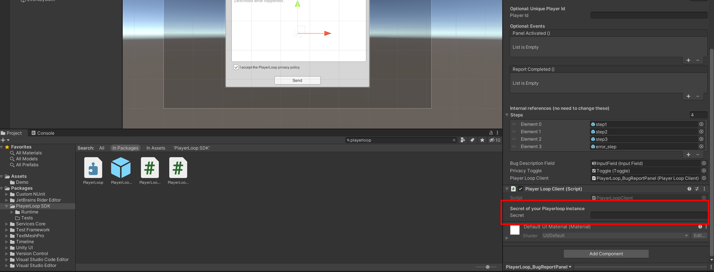
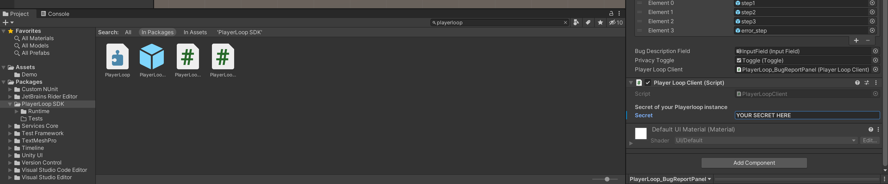

<p align="center">
  <a href="https://playerloop.io" target="_blank" align="center">
    
  </a>
  <br />
</p>

# PlayerLoop SDK for Unity

Get bug reports from your players, fast. Improve your game, reward the community.

If your player thinks there is a bug, you have something to fix. A lot of these do not throw exceptions in your code. With PlayerLoop, you can easily implement a bug reporting feature inside your game. You also get an easy-to-use interface to check the reports and download the savegame files and the screenshots to figure out what the problem is.

We are currently in free closed Beta! You can join us here on Discord: [](https://discord.gg/rGeGVqnVps)

## Getting started

>You can also check out our Youtube tutorial!

If you did not do that already, head over [playerloop.io](https://playerloop.io) and sign up for an account.

Then, in your Unity project, click on the main menu on top: `Window` and then `Package Manager`.


Now click the + icon, and click on `Add package from git URL`


Paste this URL:

```
https://github.com/playerloop/unity-sdk.git
```

Now in your Unity search bar look for PlayerLoop. Click on 'In Packages'. You will see different elements:


Drag and drop the Prefab (the blue cube icon) in your Scene. In particular, you will want to add it to your Canvas UI


Now you just need to set up your secret and you are ready to go. Click on the element you just added to the Scene. In the Inspector, look for "Player Loop Client (Script)". It should look like this:


You will need to copy/paste there your secret. To retrieve your secret, head over to [playerloop.io/account](https://playerloop.io/settings) and copy it from there:


Now paste it in the Inspector:


You are ready to go! Click play on your editor to try it out.

You can move the Prefab around so that it is shown when you prefer - for example, in your main menu screen. You can also change how the Prefab looks so that it matches your game. Check out this Youtube tutorial if you want to see how to customize your Bug Report panel.

## Using a custom UI element

If you did not do that already, head over�[playerloop.io](https://playerloop.io/)�and sign up for an account.
If you did not do that already, add the Playerloop package to your Unity project as explained in the Getting started above.
Now you can add the PlayerLoopClient C# script component to any object in your scene. Just click on `Add Component` in the Inspector and look for `PlayerLoop Client`. Add it, and then copy/paste there your secret as detailed in the Getting Started chapter above.

You can now reference that object in your scripts, by declaring it as follows:

```C#
playerLoopClient.SendReport("Description of the bug as sent by the user!");
```

You can also optionally add the path to one or more files to attach them to the report. This is useful to attach savegames for example:

```C#
playerLoopClient.SendReport("message from the user", new List<string>(){ "path-to-your-file" } );
```

You will usually call this method inside a dedicated UI screen that pops up after the user clicks on 'Report a bug' or something like that. You can check out the example below.
You can subscribe to the event:

```C#
playerLoopClient.reportSent
```

To update your UI once the report is uploaded. For example, if you have a function called `UpdateUIAfterReportSent`, you can add a listener as follows:

```C#
private void Start()
{
    playerLoopClient.reportSent.AddListener(UpdateUIAfterReportSent);
}
```

## SDK Reference

```C#
void playerLoopClient.SendReport(string ReportMessage, bool userPrivacyAccepted = false, string UserEmail = null, List<string> attachmentsFilePaths = null)
```
This function sends a report. You can attach multiple files and add a user identifier to then contact the user back. Only the first argument is mandatory. This function returns void, as it kicks off a coroutine.

```C#
playerLoopClient.reportSent
```
This is a [UnityEvent](https://docs.unity3d.com/ScriptReference/Events.UnityEvent.html) that is fired when the report is successfully uploaded. Use it to update your UI.

```C#
playerLoopClient.reportErrorInSending
```
This is a [UnityEvent](https://docs.unity3d.com/ScriptReference/Events.UnityEvent.html) that is fired when the report could not be uploaded for any reason. For example, the user may not have an active internet connection. Use it to update your UI.

```C#
playerLoopClient.OpenPrivacyPolicyPage
```
This is a function that opens the PlayerLoop Privacy Policy page. Useful to give users a chance to check out our Privacy Policy page before accepting it. Check out the sample scene to see how to use it.

## Example scene

The package includes a sample scene with a UI implementation.

## Contributing

Make a PR :)